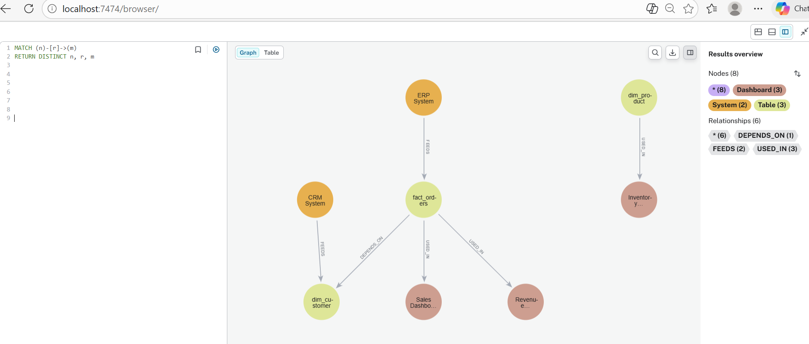
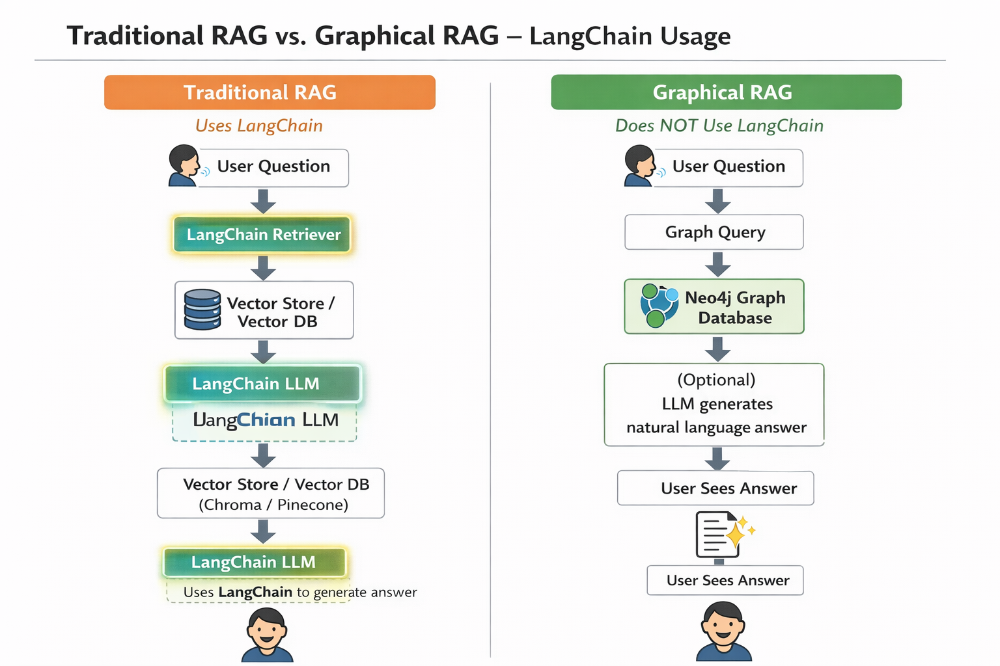
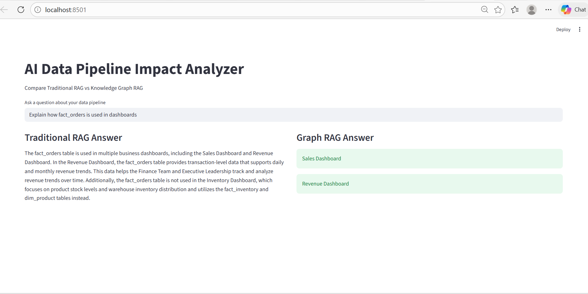

**🚀 AI Data Pipeline Impact Analyzer**

Traditional RAG vs Graphical RAG Comparison

This project demonstrates the difference between Traditional Retrieval-Augmented Generation (RAG) and Graph-based RAG (Knowledge Graph RAG) using a simplified data warehouse pipeline example.
The application allows users to ask questions about systems, tables, and dashboards, and compares how document-based retrieval and graph-based reasoning answer the same question.
A Streamlit interface displays answers side-by-side to highlight the differences.
________________________________________
**Project Goal**

Data teams often need to answer questions like:
•	Which dashboards use fact_orders?
•	What tables does fact_orders depend on?
•	Which source system feeds dim_customer?
This project demonstrates two AI approaches:
Traditional RAG
Uses documents + embeddings + LLM reasoning
Graphical RAG
Uses a knowledge graph to query structured relationships
________________________________________
## Architecture Overview

```
                  ┌───────────────────────┐
                  │      User Question    │
                  └─────────┬─────────────┘
                            │
            ┌───────────────┴───────────────┐
            │                               │
  ┌─────────▼─────────┐           ┌─────────▼─────────┐
  │ Traditional RAG   │           │ Knowledge Graph RAG │
  └─────────┬─────────┘           └─────────┬─────────┘
            │                               │
   ┌────────▼─────────┐           ┌────────▼─────────┐
   │ Question → Embedding │       │ Graph Query       │
   └────────┬─────────┘           └────────┬─────────┘
            │                               │
   ┌────────▼─────────┐           ┌────────▼─────────┐
   │ Vector Database   │           │ Neo4j Graph DB   │
   └────────┬─────────┘           └────────┬─────────┘
            │                               │
   ┌────────▼─────────┐           ┌────────▼─────────┐
   │ Top-K Documents   │           │ Graph Traversal  │
   └────────┬─────────┘           └────────┬─────────┘
            │                               │
            └──────────┐    ┌───────────────┘
                       ▼    ▼
                ┌───────────────┐
                │ LLM generates │
                │ final answer  │
                └──────┬────────┘
                       │
                ┌──────▼──────┐
                │ User sees   │
                │ answer      │
                └─────────────┘
```
________________________________________
**Technologies Used**

Component	Technology
UI	Streamlit
RAG Framework	LangChain
Embeddings	HuggingFace Sentence Transformers
Vector Database	ChromaDB
LLM	OpenAI GPT-3.5
Graph Database	Neo4j
Graph Query Language	Cypher
Document Loader	LangChain Community
________________________________________

## Project Structure

```
AI_Data_Pipeline_Impact_Analyzer
│
├── data
│   └── pipeline_docs.docx
│
├── document_loader.py      # Loads documents for Traditional RAG
├── chunk_documents.py      # Splits documents into chunks
├── vector_store.py         # Creates embeddings and vector database
├── rag_query.py            # Handles Traditional RAG queries
│
├── graph_loader.py         # Loads nodes and relationships into Neo4j
├── graph_query.py          # Executes Knowledge Graph queries
│
├── rag_comparison_app.py   # Streamlit UI to compare both approaches
│
├── images
│   ├── architecture.png
│   └── neo4j_graph.png
│
├── .env                    # Stores API keys (not uploaded to GitHub)
└── README.md
```
________________________________________
How Traditional RAG Works in This Project

1️⃣ Load pipeline documentation
The system reads pipeline documentation from the provided data files.

2️⃣ Split documents into chunks
Large documents are divided into smaller text chunks for better retrieval.

3️⃣ Generate vector embeddings
Each chunk is converted into vector embeddings using the model:

all-MiniLM-L6-v2

4️⃣ Store embeddings in a vector database
Embeddings are stored in the vector database Chroma.

5️⃣ Answer generation

When a user asks a question:

The query is converted into an embedding

The vector database retrieves top-k similar chunks

Retrieved context is sent to OpenAI GPT-3.5

The LLM generates the final natural language answer
________________________________________
How Knowledge Graph RAG Works in This Project

Instead of storing unstructured documents, this approach stores structured data lineage relationships inside Neo4j.

Graph Nodes

The knowledge graph contains the following entities:

Systems

Tables

Dashboards

Graph Relationships

The relationships capture how data flows through the pipeline:

System → FEEDS → Table

Table → DEPENDS_ON → Table

Table → USED_IN → Dashboard

Query Execution Process

When a user asks a question:

1️⃣ The system identifies the table or entity mentioned in the query

2️⃣ A Cypher query is executed against the knowledge graph

Example query:

MATCH (t:Table {name:'fact_orders'})-[:USED_IN]->(d:Dashboard)
RETURN d.name

3️⃣ Neo4j performs graph traversal to retrieve exact relationships

4️⃣ The system returns precise results directly from the graph
________________________________________
**Example Questions**

Which dashboards use fact_orders?

What tables does fact_orders depend on?

Which system feeds dim_customer?
________________________________________
**Setup Instructions**

Install Dependencies

pip install langchain
pip install langchain-community
pip install langchain-openai
pip install chromadb
pip install sentence-transformers
pip install docx2txt
pip install python-dotenv
pip install streamlit
pip install neo4j
________________________________________
Add OpenAI API Key

Create .env file
________________________________________
Create Vector Database

Run:
python vector_store.py
This generates the Chroma vector database.
________________________________________
Load Graph Data

Run:
python graph_loader.py
This loads nodes and relationships into Neo4j.
________________________________________
Start the Application

streamlit run rag_comparison_app.py
Open browser:
http://localhost:8501
________________________________________
## Traditional RAG vs Knowledge Graph RAG

| Feature | Traditional RAG | Knowledge Graph RAG |
|--------|----------------|---------------------|
| Data Source | Unstructured documents | Structured knowledge graph |
| Storage | Vector database (embeddings) | Graph database |
| Retrieval Method | Semantic similarity search | Graph traversal using relationships |
| Uses LLM | Yes | Optional (can return direct query results) |
| Relationship Accuracy | Medium | High |
| Best Use Case | Document-based Q&A | Data lineage, dependency analysis |
________________________________________
**Visual Comparison**

Traditional RAG

User Question
      │
      ▼
Embedding Model
      │
      ▼
Vector Database
      │
      ▼
Retriever
      │
      ▼
LLM
      │
      ▼
Answer


Graph RAG

User Question
      │
      ▼
Cypher Query
      │
      ▼
Neo4j Graph Database
      │
      ▼
Graph Traversal
      │
      ▼
Answer
________________________________________
**Key Learning**

This project shows that:
•	Traditional RAG is ideal for document understanding
•	Graph RAG is better for structured relationships like data pipelines
•	Combining both approaches can create powerful AI data assistants
________________________________________
**Knowledge Graph Visualization (Neo4j)**

The Graph RAG implementation stores the data pipeline structure in a Neo4j knowledge graph.

Nodes represent:

- Source Systems
- Data Warehouse Tables
- BI Dashboards

Relationships represent:

- System → FEEDS → Table
- Table → DEPENDS_ON → Table
- Table → USED_IN → Dashboard

Below is the visualization of the graph in Neo4j Browser.


________________________________________
**Architecture Diagram**


________________________________________
**Application Demo**

Below is the Streamlit application comparing Traditional RAG and Graph RAG.


________________________________________
**Future Improvements**

•	Automatic question classification
•	LLM-generated Cypher queries
•	LangChain GraphRAG integration
•	Graph visualization inside UI
•	Support for large enterprise data pipelines
________________________________________
**Author**

Rachel Purnima Johnpeter


